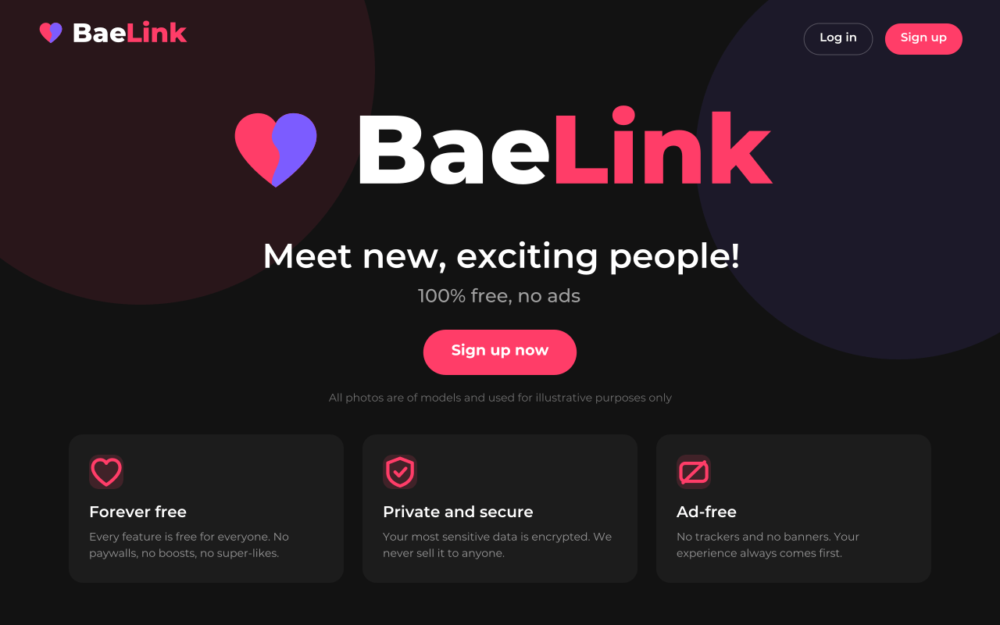
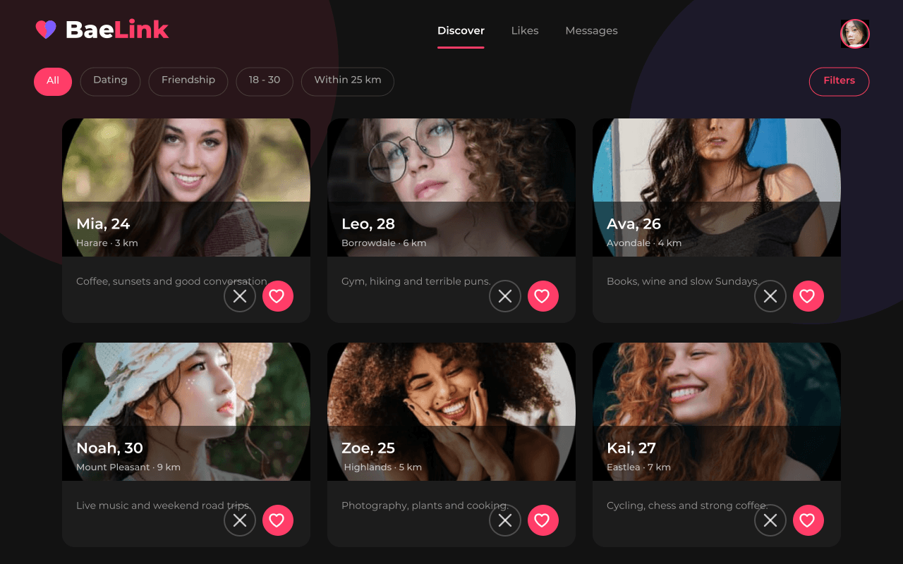
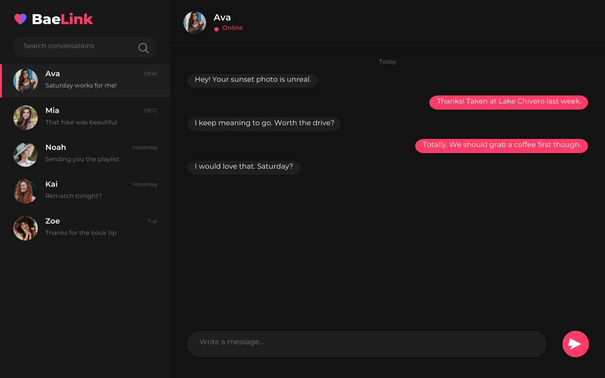

#  BaeLink

BaeLink aims to be the first widespread free and open-source dating web platform.

[](https://alovoa.com/)
[](https://beta.alovoa.com/)
[](https://codeberg.org/Nonononoki/alovoa)
[](https://github.com/nigel112/alovoa/issues)
[](https://matrix.to/#/#alovoa_love:matrix.org)
[](https://mastodon.social/@alovoa_love)
[](https://www.reddit.com/r/Alovoa/)
[](/LICENSE)

What makes BaeLink different from other platforms?
- No ads
- No selling of your data
- No paid features (no "pay super-likes", "pay to swipe", "pay to view profile" or "pay to start a chat")
- No unsecure servers
- No closed-source libraries
- No seeing people you don't want to see with advanced filters
- Your most private data is securely encrypted

### Screenshots

<p float="left">
  
  
  
</p>

### Mobile apps

The upstream project is also available as a mobile app. Check out Android app
[source code repo](https://github.com/Alovoa/alovoa-expo), download an app on
[F-Droid](https://f-droid.org/en/packages/com.alovoa.expo/) or
[Google Play](https://play.google.com/store/apps/details?id=com.alovoa.expo)

### Contribute
- Tell your friends about it and share on social media! This is the best way to make it grow.
- Improve the project by posting in [Issues](https://github.com/nigel112/alovoa/issues) and make a PR upon Issue discussion.
- Translate this project into your preferred language on [Weblate](https://hosted.weblate.org/projects/alovoa/alovoa/)

<details>
  <summary>Translation status</summary>
  
[](https://hosted.weblate.org/engage/alovoa/)
</details>

### Donate
Like this project? Consider making a donation.

| Platform        | Link                                                                                              |
| :-------------: | :-----------------------------------------------------------------------------------------------: |
| Alovoa          | [alovoa.com/donate-list](https://alovoa.com/donate-list)                                          |
| BuyMeACoffee    | [buymeacoffee.com/alovoa](https://www.buymeacoffee.com/alovoa)                                    |
| Ko-fi           | [ko-fi.com/Alovoa](https://ko-fi.com/Alovoa)                                                      |
| Liberapay       | [liberapay.com/alovoa/donate](https://liberapay.com/alovoa/donate)                                |
| Open Collective | [opencollective.com/alovoa](https://opencollective.com/alovoa)                                    |
| BTC             | <details><summary>Click to reveal</summary>`bc1q5yejhe5rv0m7j0euxml7klkd2ummw0gc3vx58p`</details> |

### How to build
- Install OpenJDK 17
- Install maven: https://maven.apache.org/install.html
- Setup a database (MariaDB is officially supported)
- Setup an email server or use an existing one (any provider with IMAP support should work)
- Enter credentials for database server, email server and encryption keys in `application.properties`
- Execute `mvn install` in the root folder

Or you can use [Docker](https://docs.docker.com/engine/install/) and [Docker compose](https://docs.docker.com/compose/).
To bring up the server, after setting the required values in ` src/main/resources/application.properties` you can just run below commands:
``` 
docker-compose build
docker-compose up -d
docker-compose logs -f
```

### Running on Windows with WSL

In an administrator PowerShell (once):

```powershell
wsl --install -d Debian
```

Then inside the Debian shell:

```sh
sudo apt update && sudo apt install -y git
git clone https://github.com/nigel112/alovoa.git
cd alovoa
bash scripts/wsl-setup.sh
```

`scripts/wsl-setup.sh` installs OpenJDK 17, Maven and MariaDB, creates the
database, generates a local `src/main/resources/application-dev.properties`
with encryption keys, builds the jar and serves BaeLink on
<http://localhost:8080>. Use `--build-only` if you just want it compiled.

### Debugging
- Spring Tool Suite / IntelliJ is recommended for debugging
- Install lombok for your IDE (Not needed for IntelliJ)

### Brand assets
Every logo, icon, splash screen and screenshot in this repository is generated
from the vector masters in [`scripts/brand`](scripts/brand):

```sh
cd scripts/brand
npm install
npm run build
```

It rebuilds `logo.svg`, the PWA icons, `favicon.ico`, the Open Graph share card,
the iOS PWA splash and the three screenshots above. Edit
[`scripts/brand/lib/brand.mjs`](scripts/brand/lib/brand.mjs) to restyle the
brand (colours, mark, wordmark, tagline) and everything follows.

### Documentation:
- Please read the [DOCUMENTATION.md](/DOCUMENTATION.md)

### Licenses:
- All code is licensed under the AGPLv3 license, unless stated otherwise.
- BaeLink is a personalized build of [Alovoa](https://github.com/Alovoa/alovoa) by nonononoki, which remains under the same license.
- All images are proprietary, unless stated otherwise.
- Third-party web libraries can be found under `resources/css/lib` and `resources/js/lib` and have their own license.
- Third-party Java libraries can be found in the `pom.xml` and have their own license.
